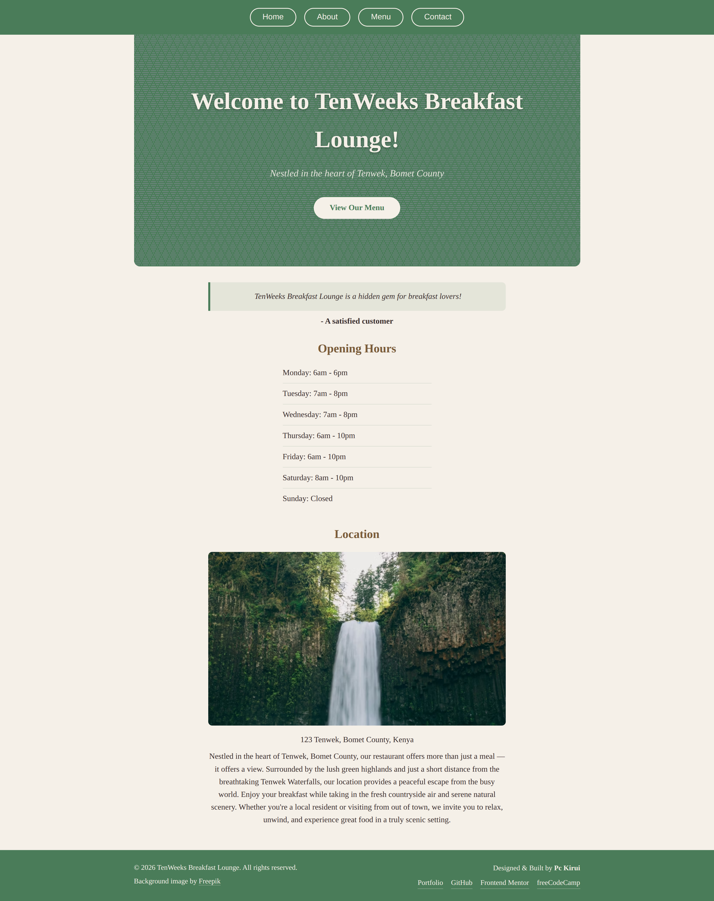

# The Odin Project - restaurant-page

This is a solution to the [Restaurant Page challenge](https://www.theodinproject.com/lessons/node-path-javascript-restaurant-page) on The Odin Project Javascript Course.

# Table of Contents

- [Overview](#overview)

  - [The Challenge](#the-challenge)
  - [Screenshot](#screenshot)
  - [Links](#links)

- [My Process](#my-process)

  - [Built With](#built-with)
  - [What I Learned](what-i-learned)
  - [Continued Development](#continued-development)
  - [Useful Resources](#useful-resources)
  - [AI Collaboration](#ai-collaboration)

- [Author](#author)

## Overview

### The Challenge

This project is part of The Odin Project's JavaScript course. It required developing a restaurant website featuring tabbed navigation to toggle between different pages. A student preview site was provided for visual inspiration.

### Screenshots

The screenshots below demonstrate the application's responsive behaviour, captured at 375px (Mobile) and 1440px (Desktop) viewports.

|                                             Mobile (375px)                                              |                                             Desktop (1440px)                                             |
| :-----------------------------------------------------------------------------------------------------: | :------------------------------------------------------------------------------------------------------: |
|  |  |

### Links

- Solution URL: [Solution](https://github.com/Pc-Kirui/restaurant-page)
- Live Site URL: [Live Preview](https://pc-kirui.github.io/restaurant-page/)

## My Process

### Built With

- HTML5 & CSS3 - Markup and responsive styling
- JavaScript (ES6+) - Logic and DOM manipulation
- NPM - Package management
- Webpack - Asset bundling and dependency management
- CSS-Loader & Style-Loader - css-loader resolves CSS imports in JavaScript modules. style-loader injects processed CSS into the DOM at runtime
- Asset Modules (webpack 5 built-in) - Handling images and static files without extra loaders

### What I Learned

To complete this project, I transitioned from traditional static multi-page development to a modern Single Page Application (SPA) workflow. Key takeaways include:

- **Modular Architecture**: I learned to use ES6 Modules to keep my code DRY (Don't Repeat Yourself). Instead of one massive file, I separated the Home, Menu, About and contact logic into independent modules.

- **The Build Pipeline**: Mastering src vs dist relationship. I now understand that we write human readable code in src and let Webpack generate browser- optimized code in dist.

- **Dynamic DOM Rendering**: I implemented a tabbed navigation system that swaps content dynamically. This mimics the behaviour of modern frameworks like React, allowing for a seamless user experience without page reloads.

- **Webpack Loaders**: I learned that Webpack is JS-Centric. By configuring css-loader, file-loader and asset/resource modules I enabled Webpack to treat styles and images as modules.

### Continued Development

- **Advanced Webpack Configuration**: While I have learned the basics of loaders and bundling, I plan to explore minification, code splitting and image optimizations for better performance.

- **CSS Architecture**: Learn BEM naming convention to write more maintainable and scalable CSS as projects grow larger.

- **JavaScript Patterns**: Deepen understanding of module patterns and explore how frameworks like React implement similar SPA concepts under the hood.

### Useful Resources

1. [The Odin Project: Webpack Lesson](https://www.theodinproject.com/lessons/javascript-webpack) - This was instrumental in understanding JavaScript bundles, src vs dist and Webpack configuration.
2. [Official Webpack Documentation](https://webpack.js.org/concepts/) - Reference for specific loader syntax and configuration procedures.
3. [Google Fonts - Playfair Display](https://fonts.google.com/specimen/Playfair+Display) - Used for elegant typography throughout the restaurant site.
4. [Hero Patterns](https://heropatterns.com/) - Free repeatable SVG background patterns used in the hero section.

### AI Collaboration

In this project I utilized AI tools to enhance my learning and efficiency.

- **Claude.ai**: Acted as a technical consultant for architectural mental models and clarifying assignment requirements.

- **GitHub copilot**: Assisted me in code completion which aided in faster completion time of the project.

- **Google Gemini**: Provided guidance on documentation.

## Author

- **Patrick Cheruiyot Kirui**
- Portfolio - [pc-kirui.github.io](https://pc-kirui.github.io/)
- Frontend Mentor - [@Pc-Kirui](https://www.frontendmentor.io/profile/Pc-Kirui)
- X (Twitter) - [@PcKirui](https://x.com/PcKirui)
- freeCodeCamp - [@pckirui](https://www.freecodecamp.org/pckirui)
